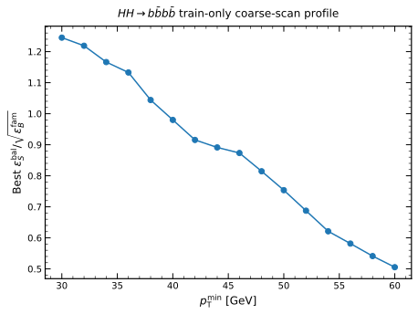
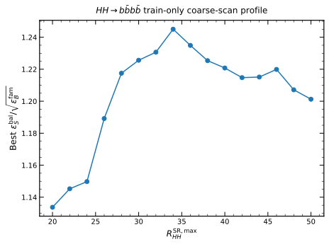
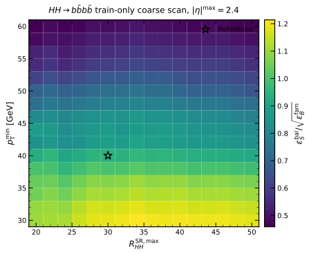
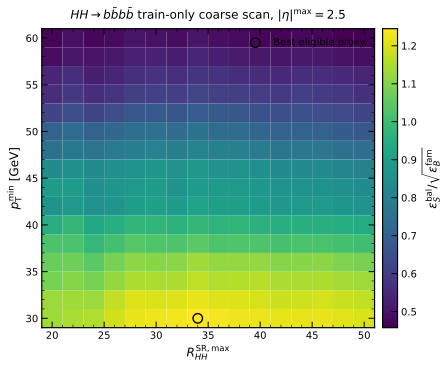
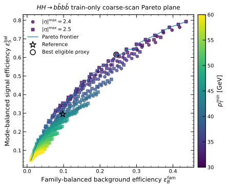

# HH4b coarse cut-scan checkpoint

## Status

This checkpoint records a **provisional train-only coarse-scan working point**. It is not the final optimized cut baseline.

- Scan points: 512
- Pareto-frontier points: 78
- Near-optimal plateau points: 6
- Validation rows used for optimization: 0
- Test files opened: 0
- Physical background normalization frozen: no
- Physical significance computed: no
- Source implementation commit: `038f793c783ed5842edcbc4891907963b7aef457`

## Provisional coarse working point

\[
p_{\mathrm{T}}^{\min}=30~\mathrm{GeV},
\qquad
|\eta|^{\max}=2.5,
\qquad
R_{HH}<34.
\]

This point maximizes the train-only family-balanced development proxy

\[
\frac{\epsilon_S^{\mathrm{bal}}}
{\sqrt{\epsilon_B^{\mathrm{fam}}}}
\]

on the frozen 512-point coarse grid.

It should be described as the **coarse proxy optimum**, not as a physical-significance optimum.

## Comparison with the reference point

| Quantity | Reference | Coarse proxy optimum |
|---|---:|---:|
| Point | `pt40_eta2p4_rhh30` | `pt30_eta2p5_rhh34` |
| Selected signal rows | 2,942 | 6,136 |
| Selected background rows | 4,225 | 11,042 |
| Balanced signal efficiency | 0.294979 | 0.615568 |
| Family-balanced background efficiency | 0.097782 | 0.244451 |
| Balanced \(S/\sqrt{B}\)-like proxy | 0.943327 | 1.245031 |
| Balanced \(S/B\)-like proxy | 3.016712 | 2.518168 |

Relative to the reference point, the coarse proxy optimum has:

- +31.98% change in the balanced \(S/\sqrt{B}\)-like proxy;
- +108.57% change in selected signal rows;
- +161.35% change in selected background rows;
- -16.53% change in the balanced \(S/B\)-like proxy.

## Physical interpretation

1. The proxy decreases as the common jet threshold is raised. Within the current candidate reconstruction, an additional jet-\(p_{\mathrm{T}}\) cut above 30 GeV is not favored.
2. The \(|\eta|<2.5\) acceptance has a slightly stronger proxy than \(|\eta|<2.4\). The tighter acceptance removes similar fractions of signal and background.
3. The useful discriminating parameter is \(R_{HH}\), with a broad coarse plateau around 30–40 and a maximum at 34.
4. The provisional point favors signal acceptance over purity. It improves the development \(S/\sqrt{B}\)-like proxy but worsens the \(S/B\)-like proxy.
5. The final operating point may move tighter after QCD normalization, background stitching, and systematic uncertainties are included.

## Near-optimal coarse shortlist

| Point | \(p_{\mathrm{T}}^{\min}\) [GeV] | \(|\eta|^{\max}\) | \(R_{HH}^{\max}\) | Signal rows | Background rows | Balanced proxy |
|---|---:|---:|---:|---:|---:|---:|
| `pt30_eta2p5_rhh34` | 30.0 | 2.50 | 34.0 | 6,136 | 11,042 | 1.245031 |
| `pt30_eta2p5_rhh36` | 30.0 | 2.50 | 36.0 | 6,422 | 12,064 | 1.234908 |
| `pt30_eta2p5_rhh32` | 30.0 | 2.50 | 32.0 | 5,789 | 10,034 | 1.230656 |
| `pt30_eta2p5_rhh30` | 30.0 | 2.50 | 30.0 | 5,431 | 9,040 | 1.225620 |
| `pt30_eta2p5_rhh38` | 30.0 | 2.50 | 38.0 | 6,687 | 13,056 | 1.225356 |
| `pt30_eta2p5_rhh40` | 30.0 | 2.50 | 40.0 | 6,934 | 14,112 | 1.220785 |

## Figures

### Best proxy versus jet threshold

### Best proxy versus \(R_{HH}\)

### Coarse heatmap, \(|\eta|<2.4\)

### Coarse heatmap, \(|\eta|<2.5\)

### Pareto plane

## Reproducibility

- Source cache SHA-256: `ac9d088152fa333dcce36c77e6c891d0c446b29f35aeb12c09d33d3133690be0`
- Configuration SHA-256: `5b7ab1f77c908cf6abc8f8b3a3bfc06ee5ea36caefed228ddd474addfc6ae52a`
- Source summary SHA-256: `a2621f617ee1f61c1b24d674753e6384a845da9749440a6a7315368557b29d2a`
- Source shortlist SHA-256: `811ea6af4583245a9227c14baa9e902aa7216261c0c9236fd73ddbf231cfaa49`

The event-level cache is intentionally not committed.

## Next gate

Run a train-only fine scan around the stable coarse region:

- \(p_{\mathrm{T}}^{\min}=30.0\)–34.0 GeV in 0.5 GeV steps;
- \(|\eta|^{\max}\in\{2.40,2.45,2.50\}\);
- \(R_{HH}^{\max}=28.0\)–42.0 in 0.5-unit steps.

Physical ranking and validation confirmation remain separate later gates.
