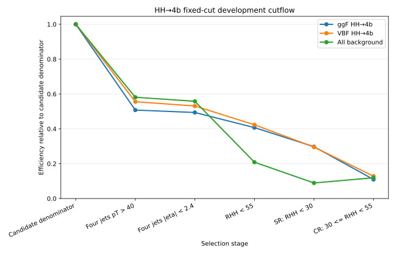
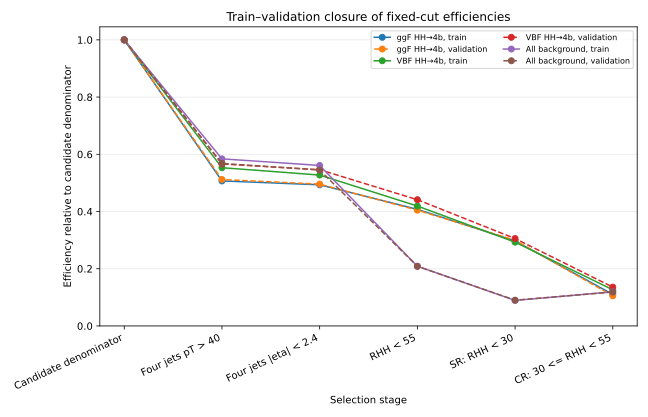
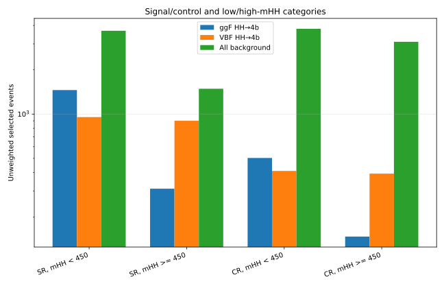
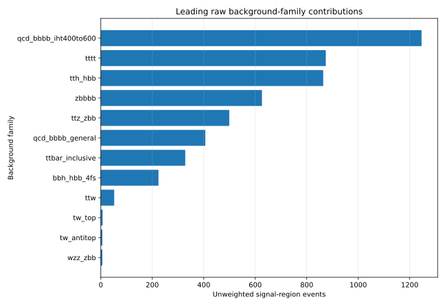
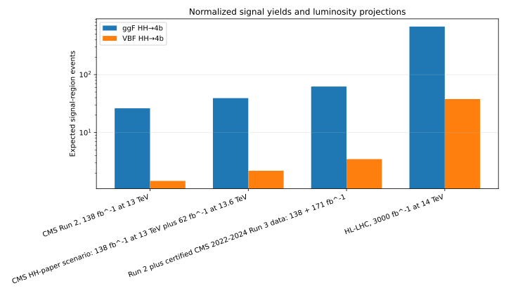

# HH→4b fixed-cut baseline results — 2026-07-24

This is the paper-oriented result package for the first frozen,
CMS-inspired resolved `HH→bbbb` cut baseline.

## Status

- Development population: train and validation only.
- Test samples remain sealed.
- ggF and VBF signal modes remain separate.
- Background families remain separate.
- No cut optimization was performed.
- Run-2 signal normalization is available.
- Physical background normalization and physical significance are pending.

## Frozen selection

| Order | Selection |
|---:|---|
| 0 | Reconstructed rich-v2 HH→4b candidate |
| 1 | All four candidate jets: `pT > 40 GeV` |
| 2 | All four candidate jets: `|eta| < 2.4` |
| 3 | Analysis region: `r_hh_125_120 < 55` |
| 4 | Signal region: `r_hh_125_120 < 30` |
| 5 | Control region: `30 <= r_hh_125_120 < 55` |
| 6 | Low-mHH: `mHH < 450 GeV` |
| 7 | High-mHH: `mHH >= 450 GeV` |

See [`tables/selection_definition.tsv`](tables/selection_definition.tsv).

## Headline signal-region results

| Process | Generated | Candidates | SR events | SR/generated | SR/candidate |
|---|---:|---:|---:|---:|---:|
| ggF HH→4b | 97,000 | 5,938 | 1,767 | 1.822% | 29.757% |
| VBF HH→4b | 100,000 | 6,283 | 1,855 | 1.855% | 29.524% |
| All background | 4,545,457 | 57,850 | 5,171 | 0.114% | 8.939% |

The fixed SR retains about 30% of reconstructed signal candidates and
about 9% of the raw background candidate population.

## Train–validation closure

The complete split-level table is
[`tables/cutflow_train_validation.tsv`](tables/cutflow_train_validation.tsv).

## Signal and control categories

See [`tables/sr_cr_categories.tsv`](tables/sr_cr_categories.tsv).

## Background-family composition

The plot and table are unweighted. They describe the generated development
sample, not expected physical yields.

- [`tables/background_family_composition_unweighted.tsv`](tables/background_family_composition_unweighted.tsv)
- [`tables/background_family_composition_weighted_PENDING.tsv`](tables/background_family_composition_weighted_PENDING.tsv)

## Signal yields and projections

See [`tables/signal_yield_projections.tsv`](tables/signal_yield_projections.tsv).

Run-3 and HL-LHC values reuse the Run-2-like selection efficiency. They are
cross-section/luminosity projections rather than energy-specific detector
simulations.

## Cut-versus-BDT comparison

The prepared comparison schema is:

[`tables/cut_vs_bdt_comparison_template.tsv`](tables/cut_vs_bdt_comparison_template.tsv)

It will later contain:

- validation ROC AUC;
- signal and background efficiencies;
- physical `S/B`;
- physical `S/sqrt(B)`;
- Asimov `Z_A`;
- the frozen BDT operating point.

Physical significance columns remain empty until the background-normalization
gate passes.

## Provenance

- Source checkpoint:
  `docs/checkpoints/hh4b_reference_baseline_20260724_v1`
- Source commit: `d01abcfdd714dd9b3da3ba82dbd600880609f5c9`
- Baseline configuration:
  `hh4b_cms_run2_resolved_rich_v2_reference_v1`
- Test candidate files opened: `0`
